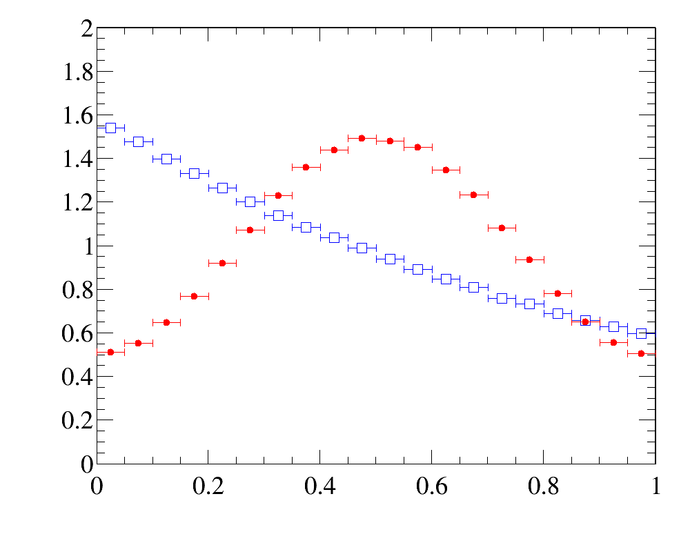
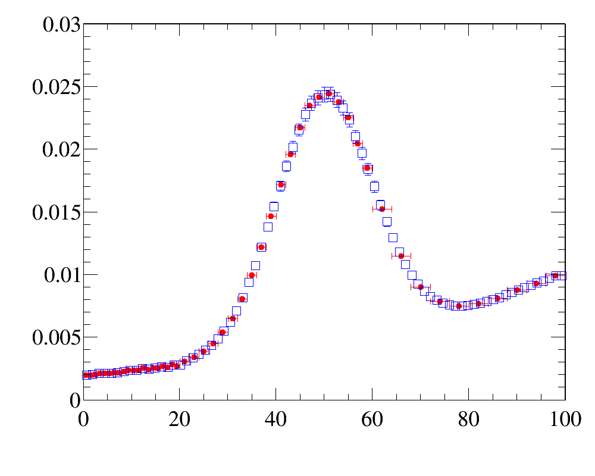
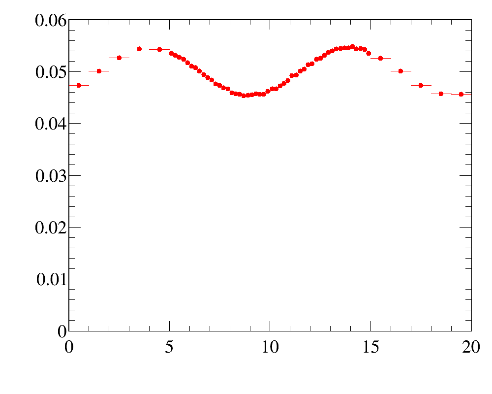
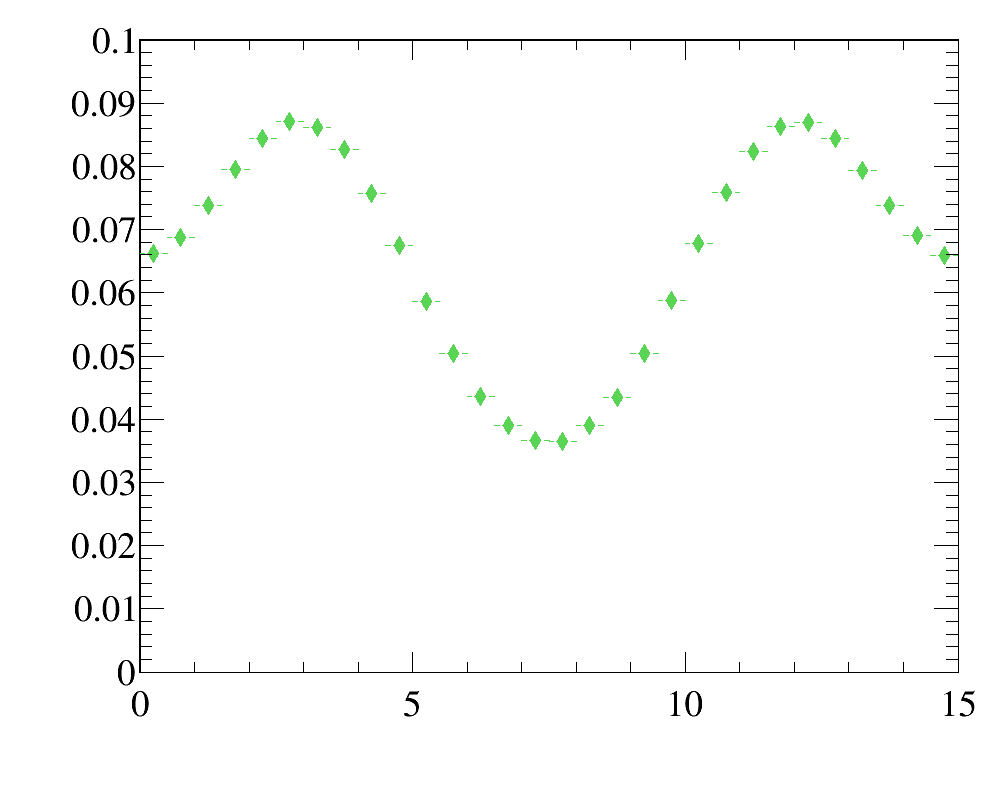
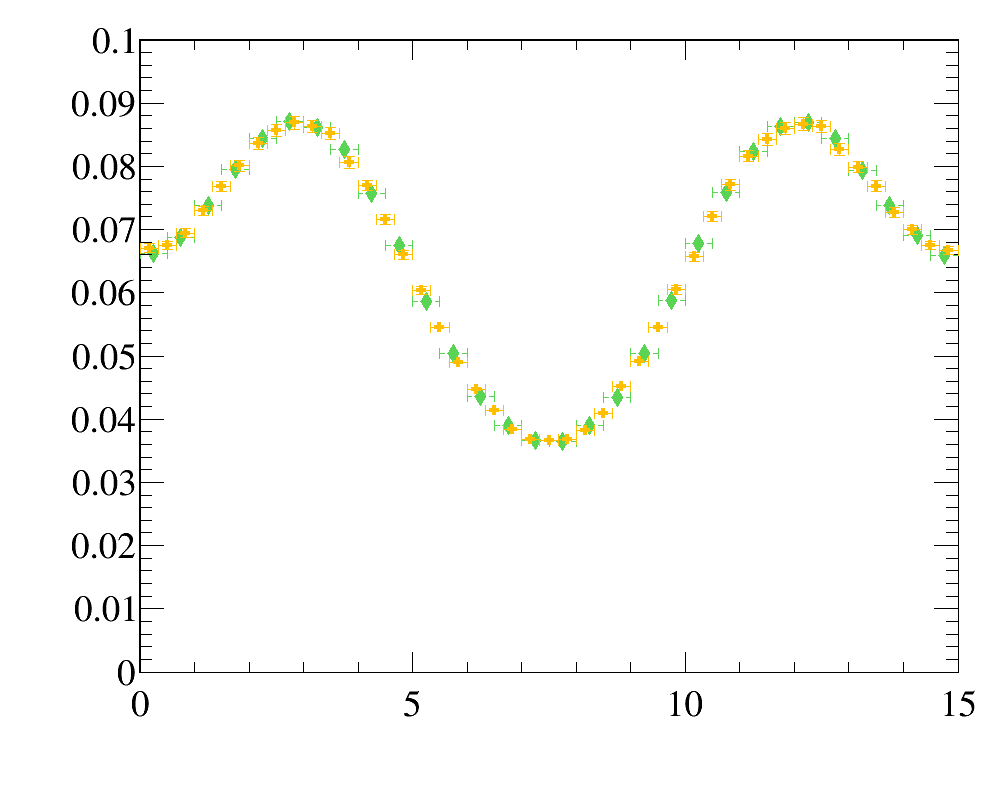
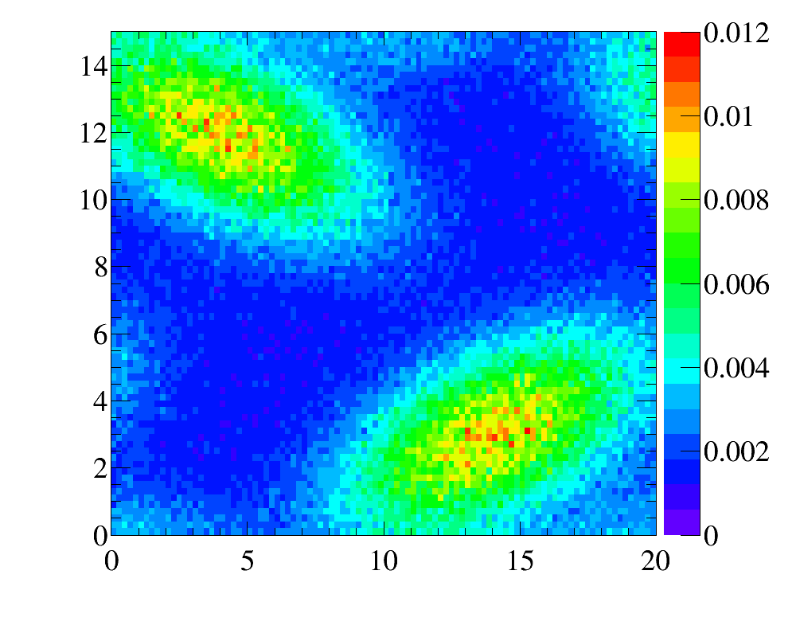

# _Reweighting_ 

Ostap offers set of  utlities to _reweight_ the distributions. Typical use-case is 
   - one has set of _data_ distributions 
   - and _simulation_ does not describe these  distributions well, and one needs to _reweight_ simulation to describe all distributions

It is relatively easy  procedure in Ostap,  however it requires some code writing.

##   _Data_ and _simulated_ distributions 
First, one needs to specify  _data_   distributions.   It can be done in form of 1D,2D and 3D histograms, or as 1,2, or 3-argument functions
or even  all these techniques could be used together. It is important that these data distributions
should be strickly positive for the corresponding range of variables. E.g. in case of histograms, there should be no empty or negative bin content.  
```python
hdata_x = ROOT.TH1D ( ... )               ## e.g. use the histogram 
hdata_x = lambda x :  math.exp (-x/10 ) ) ## or use a function 
...
hdata_y = ... 
```

Second, for each  _data distribution_ one needs to prebook the corresponding template histogram that will be filled from _simulated_ sample. This template histogram should have the  same dimensionality (1,2,3) and  the corresponidg _data distribtion_. If _data distribution_ is specified in a form of historgam, the edges of prebooked template histogram should correspond to  the edges of data distribution, but there is no requirements  for  binning. Binning could be arbtrary, provided that there are no empty bins.  
```python
hmc_x = ROOT.TH1D ( ... )
hmc_y = .... 
```

## Iterations 
Third, one needs to create _empty_ database where  _the iterative weights_ are stored: 
```python
import Ostap.ZipShelve as DBASE 
dbname = 'weights.db'
with DBASE.open( dbname ,'c') as db : 
     pass 
```
Since _Reweighting_ is  essentially  iterative procedure, we need to define some maximal number of iterations 
```python
iter_max =   10 
for iter in range(iter_max) : 
   ...
```
###  _Weighter object_ 

And for each  iteration we need to create _weighting_ object, that reads the current weights  from database `weight.db`
```python
from Ostap.Reweighting import Weight  
weightings = [
    ##         accessor function    address indatabase    
    Weight.Var ( lambda s : s.x  , 'x-reweight'  ) ,
    ...  
]    
weighter   = Weight ( dbname , weightings )
```

The accessor function is used to get the variable  from _simulated sample_. E.g. in this form, `TTree`/` TChain`/`RooDataSet`/`RooArgSet` can be used as source of _simulated_ data.
but it could be also   e.g. some table, `numpy` array or any other  storage. In this case the  accessor function needs to be modified accordingly. The   second parameter specify the location in (newly created empty) database, where the current weights are to be taked from. Since the  newly created  database is empty, for the first iteration all weights are  _trivial_ and equal to 1:
```python
mc_tree =  ...
for i in range(100): 
  mc_tree.GetEntry(i) 
  print ' weight for event %d is %s' % ( i , weighted (  mc_tree ) )  
```


###  _Weighted simulated sample_ 

As the next step one needs to prepare _simulated dataset_, `RooDataSet`, that 
 -  contains all varables for reweighting 
 -  the  current values of _weights_, provided by `weighter`-object  above 

There are many ways to achive this. E.g. one can use `SelectorWithVars`-utility to decode data  from  input `TTree`/`TChain` into  `RooDataSet`:
```python 
from Ostap.Selectors   import SelectorWithVars, Variable  
## variables to be used in MC-dataset 
variables  = [
   Variable ( 'x'      , 'x-var'  , 0  , 20 , lambda s : s.x ) ,  
   ...
   Variable ( 'weight' , 'weight' , accessor = weighter       )  
   ]
## create new "weighted" mcdataset
selector = SelectorWithVars (
   variables ,
   '0<x && x<20 && 0<y && y<20'
   )
## process 
mc_tree.process ( selector )
mcds = selector.data      ## newly created simulated dataset
print mcds 
```

### Calculate the updated weights and store them in database 

At the next step we calculate the updated weights and store them in database 
```python
from Ostap.Reweighting import makeWeights,  WeightingPlot  
plots  = [
  ##             what      how        where          data      simulated-template 
  WeightingPlot ( 'x'   , 'weight' , 'x-reweight'  , hdata_x , hmc_x       ) ,  
  ...
  ]
## calculate updated weights and store them in database 
more = makeWeights ( mcds , plots , dbname , delta = 0.01 ) ## <-- HERE 
```
The object `WeightingPlot` defines the rule to fill _simulated_ histogram from _simulated_ dataset and associated the filled _simulated_ histogram with _data distribution_. The  actual correction to the  weights is calculated according to the rule `w = dd / mcd`, where `dd` is a _density_ for the data distribution and `mcd` is a _density_ for _simulated_ distribution. The _weights_ `w` are calculated for each entry in array `plots`, they are properly normalized and stored in database `dbname` to be used for the next iteration. The   function `makeWeights` also print the _statistic_ of _normalized weights_:
```
# Ostap.Reweighting         INFO    Reweighting:           ``x-reweight'': mean/(min,max):        (1.00+-0.00)/(0.985,1.012) RMS:(0.74+-0.00)[%]
```
The last entries in this row summarize the statistics of corrections to the current weight. In this example, the mean correction is `1.00`, the minimal correction is `0.985`, the maximal correction is `1.012` and rms for corrections  is  `0.74\%`. In tihs   example one sees that for this paricualr iteration th ecorrections  are  rather small, and probably one can stop iterations. Two parameters `delta` and `minmax` of `makeWeights` function allows to automatized th emakinnng the decison.  If calculated rms for all  corrections is less than specified `delta` parameter and for each correction minnmax-difference deos not exceeed the  specified `minmax`-parameter (the default value is `0.05`), function return `False` (meaning _no  more iterations are needed_), otherwise it returns `True`. And using  this hint   one can stop iterations or go further:
```python
if not more and iter > 2 :
    print  'No more iteratinos  are needed!'
    break 
``` 
###  _Compare data and simulated distributions for each iteration (optional)_ 
In practice it is useful (and adviseable) to compare the _data_ and _simulated_ distributions at each iteration to hjave better control over the iteration process. One  can make   this   comparion using zillions of the ways, but for the most imnportant case in practice, where _data  distribution_ is  specified in a form of histogram, there are some predefined utilities
```python
## prepare simulated distribution with current weights:
mcds.project ( hmc_x , 'x' , 'weight' ) 

## compare the basic properties: mean, rms, skewness and kurtosis
hdata_x.cmp_prnt ( hmc_x , 'DATA' , 'MC' , 'DATA(x) vs MC(x)' )

## calculate the ``distance``:
dist = hdata_x.cmp_dist ( hmc_x , density = True )
print "DATA(x)-MC(x)  ``distance''        %s" % dist 

## calculate the 'orthogonality'
cost = hdata_x.cmp_cos  ( hmc_x , density = True )
print "DATA(x)-MC(x)  ``orthogonality'' %s" % cost 

## find the points of the maximal difference 
mn,mx = hdata_x.cmp_minmax ( hmc_x   , diff = lambda a,b : a/b , density = True )
print "DATA*(x)/MC(x) ``min/max-distance''[%%] (%s)/(%s) at x=%.1f/%.1f" % (
        (100*mn[1]-100) , (100*mx[1]-100) , mn[0]  , mx[0] ) 
``` 

## Using the result 

```python
from Ostap.Reweighting import Weight  
weightings = [
    ##         accessor function    address indatabase    
    Weight.Var ( lambda s : s.x  , 'x-reweight'  ) ,
    ...  
]    
weighter = Weight ( dbname , weightings )
mc_tree  =  ...
for i in range(100): 
  mc_tree.GetEntry(i) 
  print ' weight for event %d is %s' % ( i , weighted (  mc_tree ) )  
```
Note that due to explicit  specification of _accessor function_, _reweighter_ can be customised to work with any type of input _events/records_. e/g/ assuem that  _event_ is a plain _array_, 
and `x`-variable corresponds to index `0`:
```python
from Ostap.Reweighting import Weight  
weightings = [
    ##         accessor function    address indatabase    
    Weight.Var ( lambda s : s[0]  , 'x-reweight'  ) ,
    ...  
]    
weighter = Weight ( dbname , weightings )
mc_tree  =  ...
for event in  events : 
  print ' weight for event %s is %s' % ( event , weighted ( event ) )  
```


## _Abstract reweighting_ 
Due to the freadom in choosing the accessor function, one can apply reweighting procedure to the absolutely abstract samples. E.g. consider the follwing case 
  - _data distribution_ : simple function 
  - _simulated sample_  : random number generator 

As a result of _reweighting_ procedure, we'll get _reweighted simulated sample_, that  will be just a  random number generator, that produces  the _weighted_ distribution  according to the specified function. For this case, the code is very transparent and compact:
```python 
# =============================================================================
## 1)  ``DATA distribution''  - plain function
def data ( x ) :
    return 0.5 + math.sin ( x * math.pi )**2 
# =============================================================================
## 2) ``simulation template'' -  histogram template for simulated sample 
mc_hist = ROOT.TH1F ( 'hMC', '', 20 , 0 , 1  )
# =============================================================================
def mc_sample () :
    x = random.expovariate ( 1 )
    while x  > 1  : x -=1
    return x
# =============================================================================
## 3) create empty database with initial weights 
# =============================================================================
import Ostap.ZipShelve as DBASE
if os.path.exists ( dbname ) : os.remove ( dbname )
with DBASE.open( dbname ,'c') as db : 
```
And then one starts iterations:
```python
# ============================================================================
## 4) prepare reweigthing iterations
# ===========================================================================
from Ostap.Reweighting import Weight, makeWeights,  WeightingPlot
from Ostap.Selectors   import SelectorWithVars, Variable   
for iter in range ( 100 ) :    
    ##                                             accessor       address in DB    
    weighter   = Weight( dbname ,  ( Weight.Var ( lambda x : x , 'x-reweight'  ) , ) ) 
    
    ## create ``weighted'' simulated  dataset using the current weights
    selector = SelectorWithVars (
        selection  = '1<2' , ## fake one :-( to be removed soon 
        silence    = True  , 
        variables  = [ Variable ( 'x'      , 'x-var'  , 0  , 1  , lambda x : x ) ,  
                       Variable ( 'weight' , 'weight' , accessor = weighter    ) ] )    
    for  i in  range ( 1000000 ) :
        x = mc_sample () 
        selector ( x )
    mcds = selector.data 
    ##  update weights: the rule to create weighted simulated histogram
    plots = [ WeightingPlot ( 'x' , 'weight' , 'x-reweight' , data , mc_hist  ) ]    
    ## calculate the updated weights and add them into   database  
    more = makeWeights ( mcds , plots , dbname , delta = 0.01 )
    if not more and 2 <= iter : 
        logger.info ( 'No more iterations are needed #%d' % iter )
        break
```
The full example for _abstract reweighting_, is  accessible [here](https://gist.github.com/VanyaBelyaev/9a2605cb4a0a84d1fe21579636a2611e)

The _density_ distribution for the _simulated_ sample for before the first (blue open squares) and after the last (filled red points) iterations are shown here,  
while the comparison of the initial _data distribution_ (red line)   and the  _reweighted simulated   sample_ (greed filled diamonods) are shown here. 





One can argue that low-dimension reweigthing can be done withoky  iterations, just in one-go. Why one needs iterations here? 

The answer is rather simple: yes for very simple  case, like 1D-reweigthing, already the first iteration  should provide the exact result. However it is true only if _data dsitribution_ is suppleds and the historgam and the template for the _simulated_ histogram has the same binning. Otherwise the differnt binning scheme results in non-exact result for 1-step reweighting.  

For multidimensional reweighting one can avoid iteration only if all innvolved variables are totally uncorrelated,  otherwise the iterative procedure is unavoidable. 

Moreover in the presense of correlations _oscillation effect_ could occur, that prevents the quick convergency of the iterative procedure. To solve this problem, `makeWeighted`-function fior multidimensional case actually _under-correct_  the results.  It increases the number of nesessary iterations and make the reweighting procedure more slow, but itpractially eliminates the _oscillation effect_



## Examples 

### _Simple_ `1D`_-reweighting_

The example of simple 1D-reweighting can be inspected [here](https://gist.github.com/VanyaBelyaev/ab80fc08d1d4192d348147f442d5d10d), while the reweigthing  result for the last iteration (blue  open squares) are compared with _data distribution_ (red filled circled) here:  

The example also illustrates how to use various _histogram comparison functions_ to have better control over the iterative process 

### _More complicated case of non-factorizeable_ `2D`_-reweighting_

The example of advanced 2D-reweighting can be inspected [here.](https://gist.github.com/VanyaBelyaev/fb9b48500f9d7d6ec0ff5612977d7e97)
In this example we have three _data distributions_ fro two  variables 
  1  one-dimensional `x`-distribution with fine binninig
  1  one-dimensional `y`-distribution with fine binninig
  1  two-dimensional `y:x`-distribution with coarse binning




 
It reflects relatively frequent case of _kinematic reweighting_ using the transverse momentum and rapidity. Typically one has enough events to make fine-binned one-dimensional reference distributions, but two-dimensional distributions  can be obtained only with relatively coarse binning  scheme.


_Simulated_  sample is a simlpe 2D-uniform distribution. Note that the _data distributions_ are non-factorizeable, and simple 1D-reweightings here is not enought.  In this example, for the first five iteration only 2D-reweighting `y:x` is applied, and then two 1D-reweighting `x` and `y` are added.  

After the reweighting the simulated distributins are
 - for `x`-variable:  _data distribution_ (red filled circled) vs _simulated sample_ (blue open squares) 
 - for `y`-variable: _data distribution_ (green filled diamonds) vs _simulated sample_ (orange filled swiss-crosses) 
 - for `y:x`-variables  
